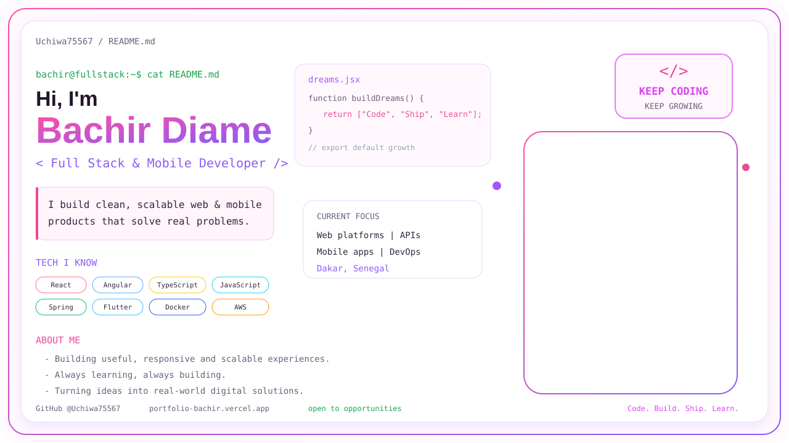
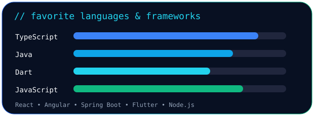
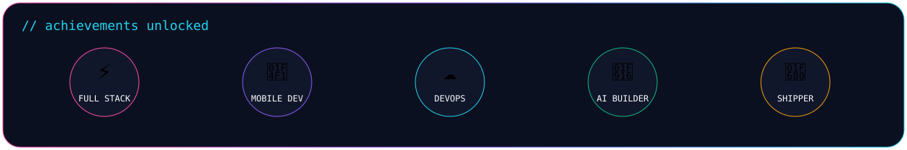

### `> ./about-me.sh`

**Full Stack Web & Mobile Developer** based in **Dakar, Senegal** 🇸🇳  
I build useful digital products across **Web • Mobile • DevOps • AI**.

---

## ⚡ `tech_stack --list`

---

## 📊 `developer --stats`

<table><tr><td width="50%"></td><td width="50%"></td></tr></table>

---

## 🐍 `contributions --animate`

<picture>
  <source media="(prefers-color-scheme: dark)" srcset="https://raw.githubusercontent.com/Uchiwa75567/Uchiwa75567/output/github-contribution-grid-snake-dark.svg">
  <source media="(prefers-color-scheme: light)" srcset="https://raw.githubusercontent.com/Uchiwa75567/Uchiwa75567/output/github-contribution-grid-snake.svg">
  
</picture>

---

### `bachir@github:~$ echo "Code. Build. Ship. Learn. Repeat."`

